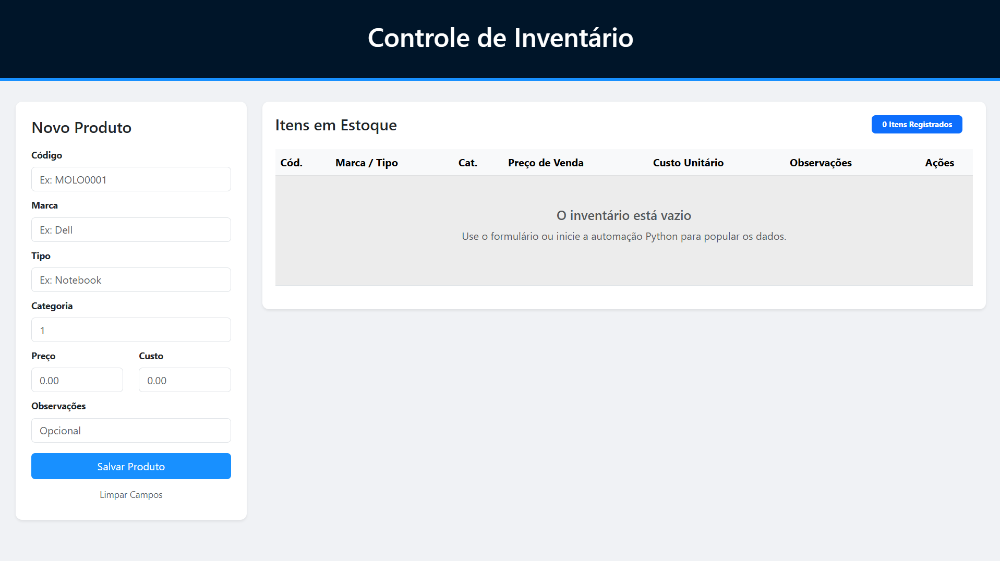

# 🚀 Sistema de Gestão de Inventário com Automação Robótica (RPA)

Este projeto une **Desenvolvimento Web** com **Automação de Processos (RPA)**. O sistema consiste em uma plataforma de cadastro de produtos integrada a um robô que realiza o preenchimento em massa de dados a partir de arquivos CSV.

> **Status do Projeto:** 🟢 Produção (Vercel)
> **Link do Sistema:** [projeto-cadastro-lake.vercel.app](https://projeto-cadastro-lake.vercel.app/)

---

## 📸 Interface



---

## 🛠️ Tecnologias Utilizadas

### Backend & Web
- **Python / Flask** — estrutura do servidor e rotas da aplicação
- **HTML5 & CSS3 (Bootstrap 5)** — interface responsiva e moderna
- **Vercel** — cloud hosting para o deploy da aplicação

### Automação (RPA)
- **Selenium WebDriver** — motor de automação para interação com o navegador
- **Pandas** — manipulação e leitura de dados do arquivo CSV
- **Keyboard** — controle de fluxo e interrupção via tecla de atalho (`ESC`)
- **WebDriver Manager** — gestão automática de drivers do Chrome

---

## 📋 Funcionalidades

- **CRUD Completo** — criação, leitura, edição e exclusão de produtos na interface
- **Automação em Massa** — o robô lê uma lista CSV e cadastra os produtos automaticamente, simulando comportamento humano em alta velocidade
- **Análise de Margens** — visualização dinâmica de preços e custos para controle financeiro
- **Controle de Fluxo** — botão de reset de lista e sistema de segurança para pausar o robô a qualquer momento via `ESC`

---

## 🚀 Como Executar

### 1. Clone o repositório
```bash
git clone https://github.com/EduardoFioreti/ProjetoCadastro.git
cd ProjetoCadastro
```

### 2. Instale as dependências
```bash
pip install -r requirements.txt
```

### 3. Inicie o servidor
```bash
python app.py
```

### 4. Acesse no navegador
```
http://localhost:5000
```

### 5. Para rodar a automação RPA
Com o servidor rodando, execute em outro terminal:
```bash
python automacao_web.py
```
> O robô vai ler o arquivo `produtos.csv` e cadastrar os itens automaticamente. Pressione `ESC` a qualquer momento para interromper.

---

## 📁 Estrutura do Projeto

```
ProjetoCadastro/
├── app.py                # servidor Flask e rotas
├── automacao_web.py      # script de automação RPA
├── produtos.csv          # lista de produtos para automação
├── requirements.txt      # dependências do projeto
├── templates/            # templates HTML
└── vercel.json           # configuração de deploy
```

---

## 👨‍💻 Autor

**Eduardo Fioreti**
- LinkedIn: [linkedin.com/in/eduardofioreti](https://www.linkedin.com/in/eduardofioreti)
- Email: eduardofioretidev@gmail.com
